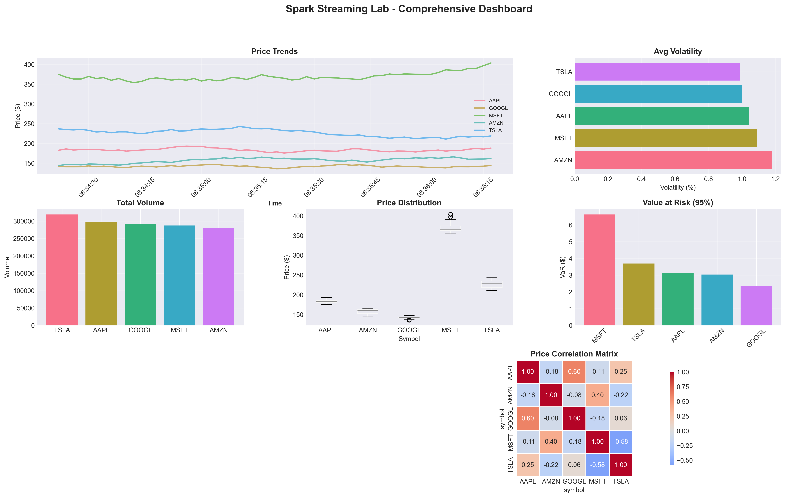
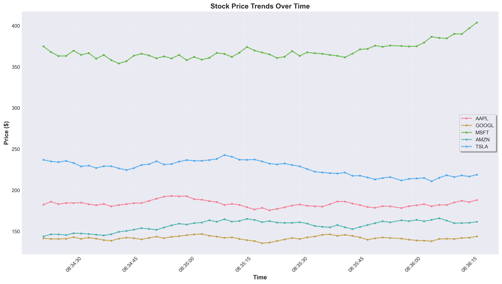
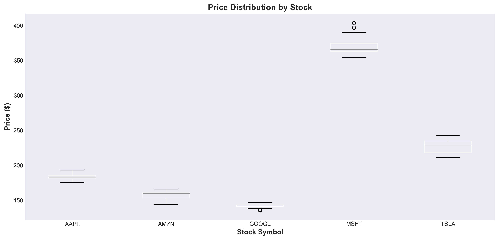
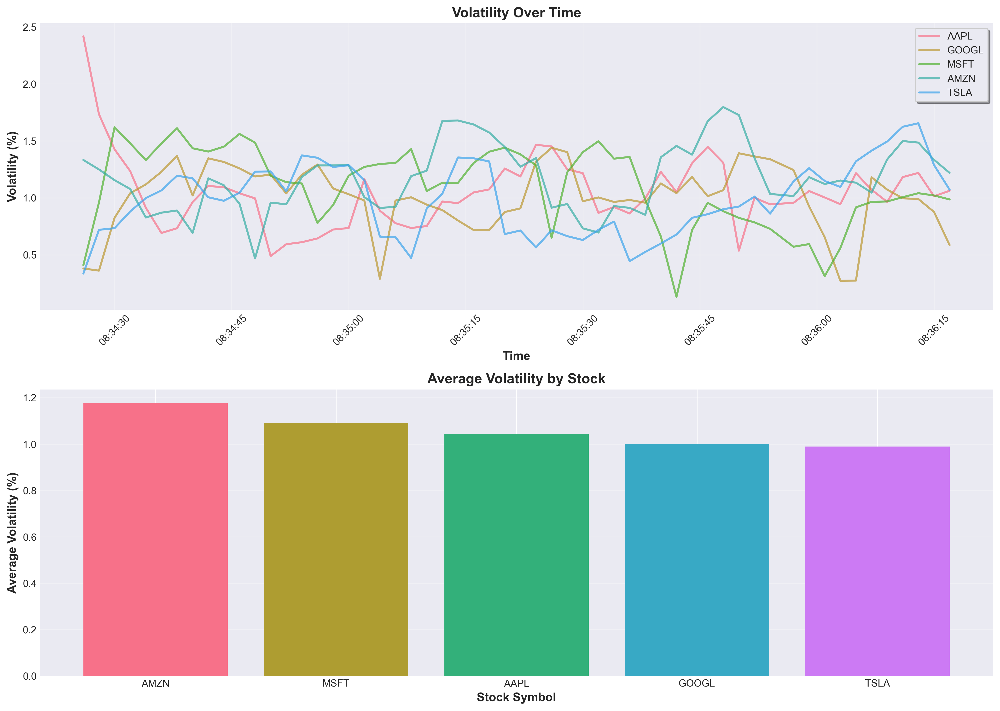
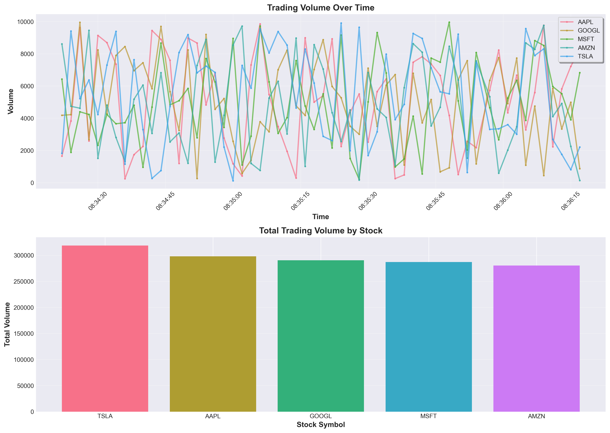
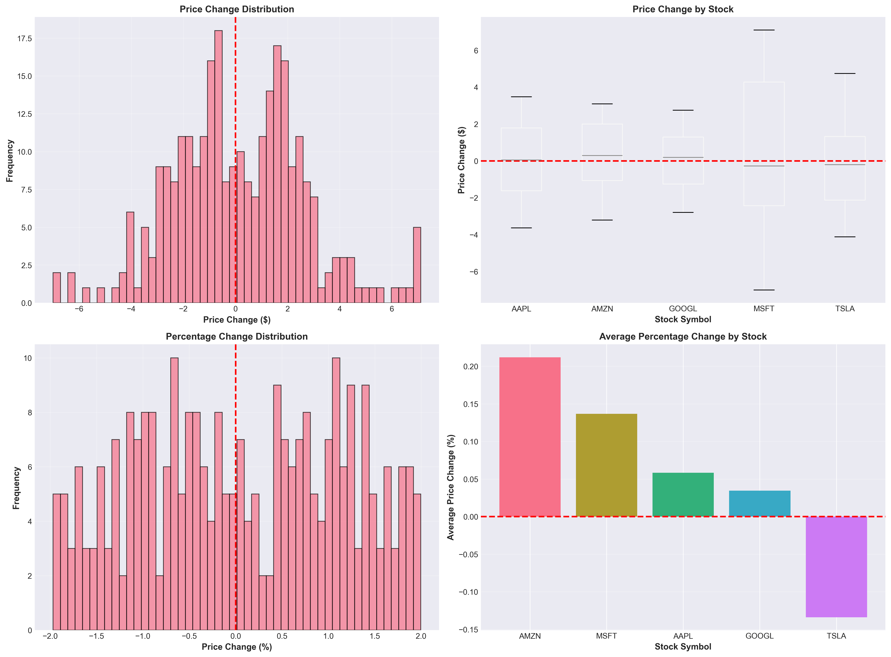
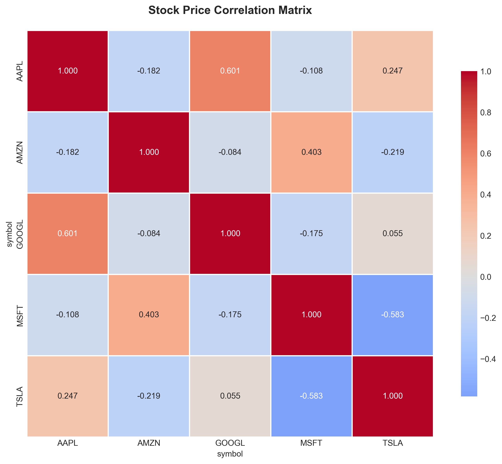
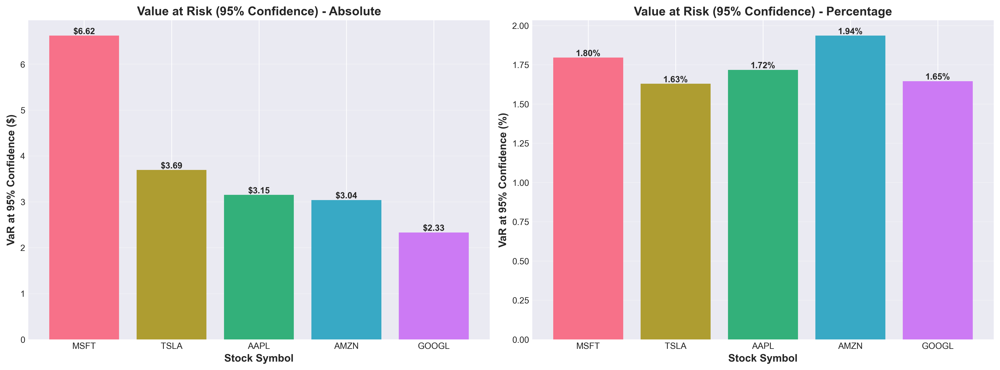

# Apache Spark Streaming Lab - Real-Time Financial Data Analysis

[](https://www.python.org/)
[](https://spark.apache.org/)
[](https://www.docker.com/)

A comprehensive demonstration of **Apache Spark Structured Streaming**, **Spark SQL**, and **MLlib** integrated into a unified pipeline for real-time financial stock data analysis.

## 📋 Table of Contents

- [Overview](#overview)
- [Features](#features)
- [Visualizations](#-visualizations)
- [Architecture](#architecture)
- [Pipeline Explanation](#pipeline-explanation)
- [Prerequisites](#prerequisites)
- [Installation](#installation)
- [Usage](#usage)
- [Project Structure](#project-structure)
- [Technical Details](#technical-details)
- [Troubleshooting](#troubleshooting)
- [Contributors](#-contributors)

## 🎯 Overview

This project demonstrates how Apache Spark unifies **batch processing**, **streaming**, and **machine learning** in a single platform. It processes simulated real-time stock market data through:

1. **Structured Streaming** - Real-time data ingestion and windowed aggregations
2. **Spark SQL** - Complex analytical queries with caching optimization
3. **MLlib** - Machine learning models for price prediction
4. **Value at Risk (VaR)** - Financial risk calculation

## ✨ Features

- 🔄 **Real-time Streaming**: Process stock tick data as it arrives
- 📊 **Windowed Aggregations**: 10-second sliding windows with 20-second watermark
- 🗄️ **SQL Analysis**: Complex queries with Catalyst Optimizer
- 💾 **Caching**: Performance comparison with/without cache
- 🤖 **Machine Learning**: Logistic Regression and Random Forest models
- 📈 **Feature Engineering**: Automatic feature creation from time series
- 💰 **Risk Analysis**: Value at Risk (VaR) calculation at 95% confidence
- 🐳 **Docker Support**: Cross-platform execution without local dependencies
- 🔧 **Cross-Platform**: Works on Windows, Linux, and Mac

## 📊 Visualizations

The following visualizations are generated from the Spark streaming lab results:

### Comprehensive Dashboard


### Price Analysis

*Stock price trends showing real-time price movements for all symbols*


*Price distribution comparison across different stocks*

### Volatility Analysis

*Volatility trends over time and average volatility by stock*

### Volume Analysis

*Trading volume over time and total volume statistics*

### Price Change Analysis

*Price change distributions and percentage changes*

### Correlation Analysis

*Stock price correlation matrix showing relationships between different stocks*

### Risk Analysis

*Value at Risk (VaR) analysis at 95% confidence level*

---

**Note:** To generate these visualizations, run:
```bash
python visualize_results.py
```

Visualizations will be saved in the `visualizations/` directory.

## 🏗️ Architecture

```
┌─────────────────────────────────────────────────────────────────┐
│                    Apache Spark Unified Platform                 │
└─────────────────────────────────────────────────────────────────┘
                              │
        ┌─────────────────────┼─────────────────────┐
        │                     │                     │
        ▼                     ▼                     ▼
┌───────────────┐    ┌──────────────┐    ┌──────────────┐
│   Streaming   │    │  Spark SQL   │    │    MLlib     │
│  (Real-time)  │───▶│  (Batch)     │───▶│  (ML Models) │
└───────────────┘    └──────────────┘    └──────────────┘
        │                     │                     │
        └─────────────────────┼─────────────────────┘
                              │
                              ▼
                    ┌─────────────────┐
                    │  Value at Risk  │
                    │   Calculation   │
                    └─────────────────┘
```

### Data Flow

```
Producer Thread
    │
    ├─▶ Generates batch_0.json, batch_1.json, ... (every 2s)
    │   Each file contains 5 stock ticks (AAPL, GOOGL, MSFT, AMZN, TSLA)
    │
    ▼
Spark readStream
    │
    ├─▶ Reads 2 files per micro-batch
    ├─▶ Parses JSON with explicit schema
    ├─▶ Converts timestamp → event_time
    │
    ▼
Windowed Aggregations
    │
    ├─▶ 10-second sliding windows
    ├─▶ 20-second watermark
    ├─▶ Groups by window + symbol
    │
    ▼
Memory Table (stock_aggregations)
    │
    ├─▶ Accessible via SQL
    ├─▶ Used for batch analysis
    ├─▶ Used for ML training
    └─▶ Used for VaR calculation
```

## 📖 Pipeline Explanation

### Part 1: Environment Setup

**Step 1.1: Java Detection**
- Automatically detects Java installation
- Checks `JAVA_HOME` environment variable
- On Windows: Also checks registry (user and system)
- Auto-corrects if `JAVA_HOME` incorrectly includes `\bin`
- Verifies Java executable exists

**Step 1.2: Spark Initialization**
- Initializes `findspark` to locate Spark
- Imports all PySpark libraries (SQL, MLlib, Streaming)
- Creates SparkSession with 4GB memory
- Configures Windows-specific Hadoop workarounds

**Step 1.3: Producer Initialization**
- Creates `StockDataProducer` instance
- Initializes 5 stock symbols with starting prices
- Prepares output directory

### Part 2: Spark Structured Streaming

**Step 2.1: Schema Definition**
- Defines explicit schema for JSON data:
  - `symbol` (String)
  - `price` (Double)
  - `volume` (Integer)
  - `timestamp` (String)

**Step 2.2: Streaming Configuration**
- Creates `readStream` with:
  - `maxFilesPerTrigger=2`: Reads 2 files per micro-batch
  - `pathGlobFilter="batch_*.json"`: Only processes batch files
  - `latestFirst=false`: Chronological order

**Step 2.3: Timestamp Conversion**
- Converts string timestamp to `TimestampType`
- Creates `event_time` column for windowing

**Step 2.4: Windowed Aggregations**
- **Watermark**: 20 seconds (tolerates late data)
- **Window**: 10-second sliding windows
- **Grouping**: By window + symbol
- **Calculations**:
  - `avg_price`: Average price in window
  - `volatility`: Standard deviation (price volatility)
  - `total_volume`: Sum of volumes
  - `tick_count`: Number of ticks
  - `min_price`, `max_price`: Price range

**Step 2.5: Streaming Query**
- Output mode: `complete` (re-evaluates all windows)
- Format: `memory` (in-memory table)
- Trigger: Every 3 seconds
- Table name: `stock_aggregations`

**Step 2.6: Producer Thread**
- Starts producer in background thread
- Generates batches every 2 seconds for 120 seconds
- Creates ~60 batch files with 5 ticks each

### Part 3: Spark SQL Analysis

**Step 3.1: View Creation**
- Creates temporary view `stock_aggregations_view`
- Enables SQL queries on streaming data

**Step 3.2: Summary Statistics**
- Calculates per-symbol statistics:
  - Overall average price
  - Average volatility
  - Total volume
  - Number of windows

**Step 3.3: Cache Performance Comparison**
- Tests query execution:
  - Without cache (2 runs)
  - With cache (2 runs)
- Demonstrates cache speedup (typically 1.5-2x faster)

**Step 3.4: Execution Plan Analysis**
- Uses `.explain('formatted')` to show:
  - Logical plan
  - Physical plan
  - Catalyst Optimizer decisions
  - Differences with/without cache

**Step 3.5: Additional Queries**
- Most volatile windows (top 5)
- Price ranges per symbol

### Part 4: Machine Learning

**Step 4.1: Data Collection**
- Collects aggregated data from streaming table
- Ensures minimum 20 records for training

**Step 4.2: Feature Engineering**
Creates 7 features from raw data:
1. **prev_price**: Previous window's price (using `lag()`)
2. **price_change**: `avg_price - prev_price`
3. **prev_volume**: Previous window's volume
4. **volume_change**: `total_volume - prev_volume`
5. **price_range**: `max_price - min_price`
6. **price_volatility**: Normalized volatility (NULL → 0)
7. **price_increase**: Binary label (1 if price increased, 0 otherwise)

**Step 4.3: ML Pipeline**
Three-stage pipeline:
1. **VectorAssembler**: Combines 6 features into dense vector
2. **StandardScaler**: Normalizes features (mean=0, std=1)
3. **Model**: Logistic Regression or Random Forest

**Step 4.4: Model Training**
- **Train/Test Split**: 80/20 ratio
- **Logistic Regression**:
  - `maxIter=100`, `regParam=0.01`
  - Evaluates with AUC and Accuracy
- **Random Forest**:
  - `numTrees=20`, `maxDepth=5`
  - Evaluates with AUC and Accuracy
  - Extracts feature importance

**Step 4.5: Model Comparison**
- Compares AUC and Accuracy metrics
- Displays feature importance rankings

### Part 5: Value at Risk

**Step 5.1: VaR Calculation**
- Formula: `VaR_95 = 1.645 × AVG(volatility)`
- `1.645`: z-score for 95% confidence (normal distribution)
- Calculates per symbol
- Sorts by VaR (highest risk first)

### Part 6: Cleanup

- Stops streaming query
- Stops producer thread
- Displays final record count
- Stops Spark session

## 📦 Prerequisites

### For Docker (Recommended):
- **Docker Desktop** installed and running
- No need to install Java or Python locally

### For Native Execution:
1. **Java 8, 11, or 17** installed
   - Download from: https://adoptium.net/ (recommended) or https://www.oracle.com/java/
   - Set `JAVA_HOME` environment variable to your Java installation directory
   - Example (Windows): `JAVA_HOME=C:\Program Files\Java\jdk-17`
   - Example (Linux/Mac): `JAVA_HOME=/usr/lib/jvm/java-17-openjdk-amd64`

2. **Python 3.7+** installed

3. **PySpark and dependencies** installed:
   ```powershell
   # On Windows, use the py launcher:
   py -m pip install pyspark findspark numpy
   
   # Or if python is in PATH:
   pip install pyspark findspark numpy
   ```

## 🚀 Installation

### Clone the Repository

```bash
git clone https://github.com/hamzaaouni/Data_Processing_Spark.git
cd Data_Processing_Spark
```

## 💻 Usage

### Option 1: Using Docker (Recommended for Windows - avoids winutils.exe issues)

```powershell
# Make sure Docker Desktop is running

# Build and run with Docker Compose
docker-compose up --build

# Or build and run manually
docker build -t spark-lab .
# On Windows PowerShell:
docker run -v "${PWD}/stock_stream:/app/stock_stream" -v "${PWD}/spark-warehouse:/app/spark-warehouse" spark-lab
# On Linux/Mac:
docker run -v "$(pwd)/stock_stream:/app/stock_stream" -v "$(pwd)/spark-warehouse:/app/spark-warehouse" spark-lab

# To run in detached mode
docker-compose up -d

# To view logs
docker-compose logs -f

# To stop
docker-compose down
```

### Option 2: Native Execution

#### Windows (PowerShell or Command Prompt)

```powershell
# Navigate to the lab directory
cd "D:\M2\Big Data 2\lab7"

# Run the script using py launcher (recommended on Windows)
py lab7.py

# Or if python is in PATH:
python lab7.py
```

**Note**: On Windows, you may need `winutils.exe` (see Troubleshooting section)

#### Linux/Mac (Terminal)

```bash
# Navigate to the lab directory
cd /path/to/lab7

# Run the script
python3 lab7.py
```

## 📁 Project Structure

```
lab7/
├── lab7.py                 # Main pipeline script
├── README.md              # This file
├── Dockerfile             # Docker image definition
├── docker-compose.yml     # Docker Compose configuration
├── .dockerignore          # Docker ignore patterns
├── run-docker.ps1         # PowerShell script for Docker (Windows)
├── run-docker.sh          # Bash script for Docker (Linux/Mac)
├── stock_stream/          # Generated streaming data (created at runtime)
│   ├── initial.json      # Initial file to avoid Hadoop issues
│   ├── batch_0.json      # Generated batch files
│   ├── batch_1.json
│   └── ...
└── spark-warehouse/       # Spark metadata (created at runtime)
```

## 🔧 Technical Details

### Key Technologies

- **Apache Spark 4.0.1**: Unified analytics engine
- **PySpark**: Python API for Spark
- **Structured Streaming**: Real-time data processing
- **Spark SQL**: SQL interface with Catalyst Optimizer
- **MLlib**: Machine learning library
- **Docker**: Containerization for reproducibility

### Configuration

- **Driver Memory**: 4GB
- **Shuffle Partitions**: 2 (optimized for small dataset)
- **Window Size**: 10 seconds
- **Watermark**: 20 seconds
- **Trigger Interval**: 3 seconds
- **Producer Interval**: 2 seconds
- **Producer Duration**: 120 seconds

### Data Schema

**Input (JSON):**
```json
{
  "symbol": "AAPL",
  "price": 180.50,
  "volume": 5000,
  "timestamp": "2025-11-07 11:06:30"
}
```

**Output (Aggregated):**
```
window_start | window_end | symbol | avg_price | volatility | total_volume | tick_count | min_price | max_price
```

## 🐛 Troubleshooting

### "JAVA_HOME not set" error
- Install Java 8, 11, or 17
- Set the `JAVA_HOME` environment variable
- Restart your terminal/command prompt after setting the variable

### "Failed to import PySpark" error
- Install PySpark: `py -m pip install pyspark findspark numpy` (Windows) or `pip install pyspark findspark numpy` (Linux/Mac)

### "Failed to create Spark session" error
- Verify Java is installed: `java -version`
- Check `JAVA_HOME` is set correctly: `echo $JAVA_HOME` (Linux/Mac) or `echo %JAVA_HOME%` (Windows)

### "UnsatisfiedLinkError" or "NativeIO" error on Windows
This is a common issue with Spark on Windows. You need to download `winutils.exe`:

1. Download winutils for Hadoop 3.x from: https://github.com/cdarlint/winutils
2. Navigate to the `hadoop-3.x.x/bin/` folder in the downloaded repository
3. Copy `winutils.exe` to: `<project-path>/hadoop_home/bin/winutils.exe`
4. Run the script again

**Alternative**: Use Docker (recommended) or WSL (Windows Subsystem for Linux) to run the script in a Linux environment.

## 📊 Expected Output

The script will:
- Create a `stock_stream/` directory with JSON batch files
- Process data in real-time using Spark Streaming
- Display streaming results with windowed aggregations
- Show SQL analysis results (statistics, cache performance, execution plans)
- Train and evaluate ML models (Logistic Regression and Random Forest)
- Calculate and display Value at Risk metrics
- Run for approximately 2-3 minutes

## 📝 Notes

- The script runs for approximately 2-3 minutes to generate and process data
- All data files are stored locally in the `stock_stream/` directory
- The script automatically cleans up old batch files before starting
- Docker execution is recommended for Windows users to avoid `winutils.exe` issues

## 🤝 Contributing

Contributions are welcome! Please feel free to submit a Pull Request.

## 📄 License

This project is for educational purposes.

## 👥 Contributors

- [@hamzaaouni](https://github.com/hamzaaouni) - Project maintainer
- [@yassinElhamdouni](https://github.com/yassinElhamdouni) - Contributor

Created as part of Big Data 2 course (M2).

---

**Key Takeaway**: This project demonstrates how Apache Spark unifies batch processing, streaming, and machine learning in a single platform with consistent APIs and shared optimization (Catalyst Optimizer).
